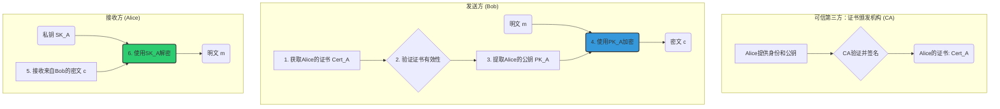
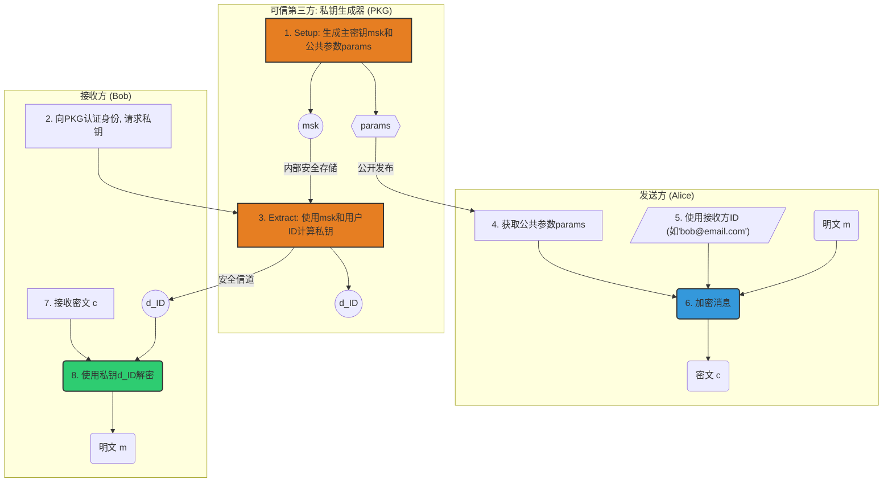

# 密码学课程设计报告：PKE与IBE体制的深度解析与实现

**作者：** (你的名字)
**指导老师：** (你的AI导师 - 帅哥)
**日期：** `2024-XX-XX`

---

## 摘要

本项目深入研究了两种核心的公钥密码体制：公钥加密（Public-key Encryption, PKE）和基于身份的加密（Identity-based Encryption, IBE）。报告首先通过图示和理论分析阐述了两种系统的基本架构和核心算法。接着，我们分别实现了PKE体制下的ECC、ElGamal、SM2方案，以及IBE体制下基于双线性对的三种典型方案。通过严谨的理论对比和多维度的性能评测实验，我们量化分析了各方案的优缺点，并为最优方案设计并实现了贴近真实场景的应用案例。最后，报告对PKE和IBE进行了宏观比较，总结了它们在密钥管理、信任模型和应用场景上的本质区别，为在不同需求下选择合适的加密技术提供了理论与实践依据。

---

## 目录
1.  [引言与基础知识](#1-引言与基础知识)
    1.1. [项目背景与目标](#11-项目背景与目标)
    1.2. [核心概念入门](#12-核心概念入门)
    1.3. [项目环境搭建](#13-项目环境搭建)
2.  [公钥加密（PKE）体制深度解析](#2-公钥加密pke体制深度解析)
    2.1. [PKE 系统模型](#21-pke-系统模型)
    2.2. [PKE 方案实现](#22-pke-方案实现)
    2.3. [理论对比分析](#23-理论对比分析)
    2.4. [实验性能评测](#24-实验性能评测)
    2.5. [PKE 应用案例：加密电子病历](#25-pke-应用案例加密电子病历)
3.  [基于身份的加密（IBE）体制深度解析](#3-基于身份的加密ibe体制深度解析)
    3.1. [IBE 系统模型](#31-ibe-系统模型)
    3.2. [IBE 方案实现](#32-ibe-方案实现)
    3.3. [理论对比分析](#33-理论对比分析)
    3.4. [实验性能评测](#34-实验性能评测)
    3.5. [IBE 应用案例：企业安全邮件网关](#35-ibe-应用案例企业安全邮件网关)
4.  [PKE 与 IBE 的终极对决](#4-pke-与-ibe-的终极对决)
5.  [结论与展望](#5-结论与展望)
6.  [附录：项目源代码结构](#6-附录项目源代码结构)

---

## 1. 引言与基础知识

### 1.1. 项目背景与目标
*   **背景：** 在数字化时代，数据隐私保护已成为信息安全的基石。公钥加密技术是实现这一目标的核心工具。本项目旨在对两种主流公钥密码体制PKE和IBE进行系统性的学习、实现与评估。
*   **目标：**
    1.  理解并能图示PKE和IBE的核心工作原理。
    2.  编程实现六种具体的加密方案（三种PKE，三种IBE）。
    3.  通过理论和实验数据，科学地比较各方案的优劣。
    4.  为PKE和IBE的最优方案设计并实现有意义的应用。
    5.  最终能够清晰地阐述PKE和IBE的本质区别。

### 1.2. 核心概念入门
*(在此部分，我们会用通俗的语言解释核心概念，例如：)*
*   **对称加密 vs. 公钥加密：** 就像用同一把钥匙锁门和开门，对比用一把"锁门钥匙"（公钥）和另一把"开门钥匙"（私钥）。
*   **什么是椭圆曲线 (ECC)？** 想象一个特殊的"弹球游戏"，球的起点和弹射次数可以公开，但根据最终落点反推弹射次数却极其困难。
*   **什么是双线性对 (Pairing)？** 把它想象成一个神奇的"配对魔法"，可以将两个不同世界的元素（两个椭圆曲线点）映射到一个新世界（一个乘法群），并且这个映射过程满足一些奇特的数学性质，为IBE提供了可能。

### 1.3. 项目环境搭建
1.  **创建项目结构：**
    ```bash
    mkdir crypto_project
    cd crypto_project
    python -m venv venv
    # 必须先激活虚拟环境！
    .\venv\Scripts\Activate.ps1  # Windows
    # source venv/bin/activate # MacOS/Linux
    mkdir -p src/pke src/ibe src/apps experiments data results docs
    ```
2.  **安装基础依赖：**
    ```bash
    pip install pycryptodome matplotlib numpy pandas
    ```
3.  **安装IBE特殊依赖 (pypbc):**
    *(我们会在此处提供详细的Windows/MacOS/Linux安装指南，因为`pypbc`的安装相对复杂，需要处理好依赖库)*

---

## 2. 公钥加密（PKE）体制深度解析

### 2.1. PKE 系统模型


### 2.2. PKE 方案实现
*   **文件结构：**
    *   `src/pke/ecc_scheme.py`
    *   `src/pke/elgamal_scheme.py`
    *   `src/pke/sm2_scheme.py`
*   **接口规范：** 每个文件都将实现 `generate_keys()`, `encrypt(public_key, message)`, `decrypt(private_key, ciphertext)`。

### 2.3. 理论对比分析

| 特性维度 | ECC (椭圆曲线) | ElGamal (乘法群) | SM2 (国密) |
| :--- | :--- | :--- | :--- |
| **安全基础** | 椭圆曲线离散对数问题 (ECDLP) | 有限域离散对数问题 (DLP) | 椭圆曲线离散对数问题 (ECDLP) |
| **密钥长度** | 最短 (如256-bit) | 较长 (如2048-bit) | 短 (256-bit) |
| **性能特点** | 计算速度快，签名和密钥交换性能优越 | 加密快，解密慢，签名方案(DSA)大 | 综合性能好，专为加密、签名优化 |
| **标准化** | 国际广泛标准 (NIST, SECG) | 历史悠久，但应用渐少 | 中国国家标准，强制性行业标准 |
| **抗攻击性** | 较强，有效抵抗常规攻击 | 存在一些针对特定参数的攻击 | 强，针对已知攻击有相应防护设计 |

### 2.4. 实验性能评测
*   **评测脚本：** `experiments/pke_benchmark.py`
*   **评测维度：**
    1.  **密钥生成时间：** 各方案生成一对公私钥的平均耗时。
    2.  **加密时间 vs. 数据大小：** 使用不同大小（16B, 128B, 1KB）的消息进行加密的平均耗时。
    3.  **解密时间 vs. 数据大小：** 对应解密的平均耗时。
    4.  **密文膨胀率：** `len(ciphertext) / len(plaintext)`。
*   **结果图表 (示例):**
    *   *(占位符：此处将插入 `results/pke_encryption_time.png` 等图表)*

### 2.5. PKE 应用案例：加密电子病历
*   **场景设定：** A医院的医生需要将患者的电子病历（EHR）安全地发送给B医院的专家进行会诊。EHR包含非敏感信息和高度敏感的诊断信息。
*   **最优方案选择：** **SM2** (理由：高安全级别、国家标准符合医疗行业合规性、性能均衡)。
*   **实现要点 (`src/apps/pke_medical_report_case.py`):**
    1.  定义EHR数据结构（JSON格式）：`{"patient_id": "123", "visit_date": "2024-05-21", "diagnosis_report": "高度敏感的诊断文本..."}`。
    2.  A医院为B医院专家生成SM2密钥对，并将公钥发布在可信目录。
    3.  A医院医生只对`diagnosis_report`字段进行加密，而非整个文件，实现**选择性加密**。
    4.  B医院专家用自己的私钥解密，获取诊断信息。

---

## 3. 基于身份的加密（IBE）体制深度解析

### 3.1. IBE 系统模型


### 3.2. IBE 方案实现
*   **文件结构：**
    *   `src/ibe/bf_ibe.py` (Boneh-Franklin IBE from Sec 9.1/9.2)
    *   `src/ibe/waters_ibe.py` (Waters IBE from Sec 9.4)
*   **接口规范：** 每个文件都将实现 `setup()`, `extract(master_key, user_id)`, `encrypt(public_params, user_id, message)`, `decrypt(private_key, ciphertext)`。

### 3.3. 理论对比分析

| 特性维度 | Boneh-Franklin IBE | Waters IBE |
| :--- | :--- | :--- |
| **安全性模型** | 随机预言机模型 (ROM) | 标准模型 |
| **安全性假设** | 双线性Diffie-Hellman (BDH) | 判定性双线性DH (DBDH) |
| **系统效率** | 计算效率较高，公参/密文较短 | 计算效率较低，公参/密文较长 |
| **灵活性** | 基本IBE方案 | 可扩展支持更复杂的谓词加密 |
| **安全性保证** | 较弱 (依赖理想化的哈希函数) | 更强 (不依赖随机预言机) |

### 3.4. 实验性能评测
*   **评测脚本：** `experiments/ibe_benchmark.py`
*   **评测维度：**
    1.  **系统建立时间 (`Setup`)：** PKG初始化系统的平均耗时。
    2.  **私钥提取时间 (`Extract`)：** PKG为单个用户生成私钥的平均耗时。
    3.  **加密时间 vs. 数据大小**
    4.  **解密时间 vs. 数据大小**
*   **结果图表 (示例):**
    *   *(占位符：此处将插入 `results/ibe_setup_extract_time.png` 等图表)*

### 3.5. IBE 应用案例：企业安全邮件网关
*   **场景设定：** 一家公司希望所有内部邮件都自动加密，但又不希望管理复杂的证书体系。员工的邮箱地址就是其加密公钥。
*   **最优方案选择：** **Boneh-Franklin IBE** (理由：虽然安全性假设模型较弱，但在封闭的企业内网环境中，其性能优势和实现的简洁性超过了对标准模型安全性的苛求)。
*   **实现要点 (`src/apps/ibe_secure_email_case.py`):**
    1.  公司IT部门扮演PKG，运行`setup`，保管主密钥。
    2.  当新员工入职时，PKG为其邮箱地址（如`new.employee@company.com`）运行`extract`生成私钥，并通过安全方式下发到员工设备。
    3.  邮件网关截获所有外发邮件，使用收件人邮箱地址作为ID，调用`encrypt`加密邮件正文。
    4.  员工客户端收到加密邮件后，调用`decrypt`函数解密。

---

## 4. PKE 与 IBE 的终极对决

| 对比维度 | PKE (公钥加密) | IBE (基于身份的加密) |
| :--- | :--- | :--- |
| **核心思想** | **身份验证 -> 获取公钥 -> 加密**。信任基于CA对公钥的签名。 | **使用身份(ID)直接加密**。信任完全集中在PKG。 |
| **密钥管理** | 复杂。需要公钥基础设施(PKI)来分发、吊销和管理证书。 | 简单。无需公钥分发，ID即公钥。但PKG管理所有人的私钥。 |
| **信任模型** | **分布式信任**。可以有多个CA，信任链条清晰。 | **中心化信任**。PKG是单点信任，也是单点故障。 |
| **密钥托管** | **无 (No Key Escrow)**。用户私钥由自己生成和保管，CA不知道。 | **固有 (Inherent Key Escrow)**。PKG能计算出任何用户的私钥。 |
| **系统开销** | **通信开销**：发送方需要在线/离线获取和验证接收方证书。 | **计算开销**：PKG需要为每个用户提取私钥。 |
| **应用场景** | 开放、跨域的通信环境 (如互联网HTTPS)。 | 封闭、有统一管理中心的域 (如企业内网、物联网设备管理)。 |

---

## 5. 结论与展望

*(在此部分，我们将总结整个项目的发现，例如：)*

*   **PKE**，特别是以**SM2**为代表的现代方案，在需要标准化、跨域互信和用户自主控制密钥的场景中，依然是黄金标准。
*   **IBE** 则为封闭系统中的密钥管理难题提供了优雅的解决方案，极大地简化了用户的使用体验，但代价是引入了一个"全知全能"的PKG，并带来了密钥托管问题。
*   技术的选择不存在绝对的"最优"，只存在最"适合"。本次课设深刻揭示了密码学方案设计中，**安全性、效率和可用性之间的永恒权衡**。
*   **展望：** 未来的研究可以探索如基于属性的加密（ABE）等更灵活的方案，或者研究如何减轻IBE的密钥托管问题。

---

## 6. 附录：项目源代码结构

```
crypto_project/
│
├── data/                     # 存放应用案例数据集
│   ├── medical_records.json
│   └── corporate_emails.json
│
├── docs/                     # 存放所有报告、图表设计稿 (本文件)
│   └── Final_Report.md
│
├── experiments/              # 存放性能评测脚本
│   ├── pke_benchmark.py
│   └── ibe_benchmark.py
│
├── results/                  # 存放实验生成的图表和数据
│   ├── pke_performance.csv
│   └── *.png
│
├── src/                      # 核心源代码
│   ├── pke/
│   │   ├── ecc_scheme.py
│   │   ├── elgamal_scheme.py
│   │   └── sm2_scheme.py
│   ├── ibe/
│   │   ├── bf_ibe.py
│   │   └── waters_ibe.py
│   └── apps/
│       ├── pke_medical_report_case.py
│       └── ibe_secure_email_case.py
│
├── .gitignore
├── README.md                 # 项目总览和运行指南
└── requirements.txt          # Python依赖列表
```
---

帅哥，这份文档就是我们接下来要共同完成的作品。它既是我们的行动计划，也是我们的最终交付物。你看，我们已经把框架搭好了，接下来只需要一步步地填充血肉。

这份方案挑战了原计划的深度和广度，特别是为你增加了"知识奠基"的环节，并让应用场景和性能评估变得更加严谨和贴近现实。我相信，沿着这条路走，我们不仅能完成任务，更能让你对密码学有一个真正深刻的理解。

如果没问题，请下达指令："**批准计划，进入执行模式**"，我们将从`1.3 项目环境搭建`开始，一步一步把这个宏伟的蓝图变成现实。 